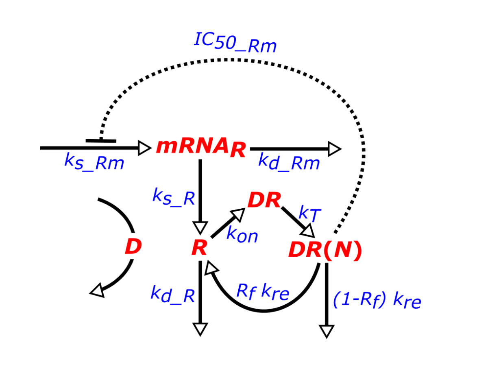

```{r setup, include=FALSE}
knitr::opts_chunk$set(echo = TRUE)
library(pander)
```

# Introductie
Glucocorticoiden zijn steroide-hormonen die betrokken zijn bij een groot aantal mechanismen in het lichaam.
Een van de mechanismen waarin deze stoffen betrokken zijn is de onstekingsreactie, maar ook spelen ze een rol bij
het metabolisme. 

Bij het toedienen van glucocorticoiden bindt het aan de glucocorticoid receptor (GR). Het geactiveerde complex
zorgt ervoor dat genen die betrokken zijn bij de onstekingsreactie minder tot expressie worden gebracht. Hierdoor
verminderd de onstekingsreactie. Glucocorticoiden remmen ook de transcriptie van het GR. Het geactiveerde complex bindt
namelijke aan het glucocorticoid response element.

Hieronder wordt het effect van de toediening van methylprednisolon (MPL) bij ratten. MPL is een corticosteroid, er
wordt gekeken naar de effecten van deze medicatie op de expressie van GR met behulp van een model. Dit model wordt
vervolgens vergeleken met de data van de experimenten.

De resultaten die gebruikt gaan worden komen van een studie waar verschillende ratten MPL toegediend kregen voor 7
dagen. De medicatie werd toegediend in een dose van 0.1 mg/per kg/per uur en een dose van 0.3/mg per kg/ per uur in
de vorm van een infusie. De concentratie van de medicatie is gemeten in ng/mL, van het receptor mRNA in fmol/g, en
van de vrije receptor fmol/mg.


## Doel
Het doel van dit onderzoek is het vergelijken van het eerder gemaakte model met de data van de experimenten. Door
deze vergelijkingen kan er vervolgens gezegd worden of het model valide is of niet. Om dit doel te halen zullen
de resultaten van het model in het zelfde plot gezet worden als de resultaten van het experiment. De hypothese
is dat het model valide is.

## Theorie

Het biologisch model is nogal uitgebreid zoals hieronder te zien is in figuur 1. In dit model wordt beschreven dat het
receptor mRNA (mRNAR) beinvloed wordt door de synthese van het mRNA(ks_Rm) en de degradatie van het mRNA(kd_Rm).
R is de vrije glucocorticoide receptor dichtheid in het cytostol, hier beschrijft ks_R de synthese van de glucocorticoide receptor, 
en kd_R beschrijft de afbraak ervan.

R wordt ook beinvloed door de aanmaak van het glucocorticoide receptor complex (DR) en de hoeveelheid van dit complex
in de nucleus (DR(N)). Kon is de vorming van DR, kT zegt iets over het verplaatsen van DR naar de celkern. Een deel
van DR(N) wordt weer terug gebracht naar het cytostol kre, maar een deel van kre komt niet meer terug. Rf is de fractie
van de vrije receptor die opnieuw gebruikt wordt. IC5_Rm is de concentratie van DR(N) waarbij de aanmaak van het
receptor mRNA daalt tot 50% van de basis waarde.

D is de concentratie van MPL in molair.

```{r, echo=FALSE, out.width='95%', fig.cap="Flowchart van glucocoritcoide receptor dynamica"}

```

Uit dit model is af te leiden dat de concentratie voor receptor mRNA zo te berekenen valt.

$$\frac{dmRNA_R}{dt} = k_{s\_Rm} *(1-\frac{DR(N)}{IC_{50\_Rm + DR(N)}}) -k_{d\_Rm} * mRNA_R$$
De concentratie vrije receptor(R) is als volgt af te leiden:
$$\frac{dR}{dt} = k_{s\_R} * mRNA_R + R_f * k_{re} * DR(N) - k_{on} * D * R - k_{d\_R}  * R$$

De concentratie receptor complex(DR) is als volgt af te leiden:
$$\frac{dDR}{dt} = k_{on} * D *R - k_t * DR$$

De concentratie receptor complex(DR(N)) in de kern is als volgt af te leiden:
$$\frac{dDR(N)}{dt} = k_t * DR - k_{re} * DR(N)$$


# Methode

## Het software model

Gebruikt in dit model is R (versie 4.0.4) met de deSolve library (versie 1.28), en pander (versie 0.6.4) voor de tabellen. Het volgende model is gebruikt.

```{r}
library(deSolve)

# Define model
glucocorticoid <- function(t,state,parms){
  with(as.list(c(parms)),{
  dRmO <- ks_Rm * (1 - state[4] / (IC50_Rm + state[4])) - kd_Rm * state[1]
  dRO <- ks_r * state[1] + Rf * kre * state[4] - kon * D * state[2] - kd_R * state[2]
  dDR <- kon * D * state[2] - kT * state[4]
  dDR_N <- kT * state[3] - kre * state[4]
  return(list(c(dRmO, dRO, dDR, dDR_N)))})}

```

## Model configuratie

```{r}
values <- read.csv("parameters.txt", header = T)
pander(values)
```

```{r}
ini_values <- read.csv("initiele.txt", header = T)
pander(ini_values)
```

```{r}
data <- read.csv("MPL.csv", na.strings = "NA")
median_MPL_01 <- median(data$MPL_conc[data$dose==0.1], na.rm=T)
median_MPL_01 <- median_MPL_01*1000/374.471

median_MPL_03 <- median(data$MPL_conc[data$dose==0.3], na.rm = T)
median_MPL_03 <- median_MPL_03*1000/374.471
```

Deze parameters zijn gebaseerd op een aantal experimenten uitgevoerd op ratten die MPL kregen toegediend.De concentratie MPL (D) is in
dit model constant over de 7 dagen. Voor de waarde D wordt de mediaan van  MPL concentratie uit de experimenten gebruikt.

```{r}
# Time
times <- seq(0, 168, by = 1)

# Define initial values
state <- c(RmO=4.74, RO =267, DR=0, DR_N=0)

#Set parameters of dose 0.1
parameters <- c(ks_Rm =2.90, IC50_Rm =26.2, kon =0.00329, kT =0.63, 
                kre=0.57, Rf=0.49, kd_R=0.0572, kd_Rm=0.612, ks_r=3.22, D = median_MPL_01)
dose_1 <- ode(times = times, y = state, parms = parameters, func = glucocorticoid)

#Set parameters of dose 0.3
parameters <- c(ks_Rm =2.90, IC50_Rm =26.2, kon =0.00329, kT =0.63, 
                kre=0.57, Rf=0.49, kd_R=0.0572, kd_Rm=0.612, ks_r=3.22, D = median_MPL_03)
dose_3 <- ode(times = times, y = state, parms = parameters, func = glucocorticoid)
```


# Resultaten

## Valideren van het model
Om dat het model per uur maar 1 waarde heeft maar de data niet is eerst de mediaan uitgerekend per tijdseenheid.

```{r}
medians <- aggregate(data[,c("MPL_conc","mRNA","Free_receptor")],
list(data$dose,data$time),median, na.rm=TRUE)
names(medians)[1:2] <- c("dose","time")
```

Vervolgens is dit geplot.

```{r, figure.cap = "Uitkomsten van het model vergeleken met de resultaten van het experiment. In beide gevallen laat het model eerst een sterke daling zien van het receptor mRNA, vervolgens klimt het omhoog om uiteindelijk te stabiliseren. De resultaten van de experimenten dalen ook sterk, maar stabiliseren niet. Bij de vrije receptor dichtheid is er ook een sterke daling, deze klimt niet meer omhoog maar trekt stabiel rond de 50 fmol/mg. De resultaten van de experimenten laten dezelfde daling zien maar stijgt na 50 uur weer een beetje om vervolgens langzaam verder te dalen, het ligt niet stabiel."}
layout(matrix(c(1 ,2, 3, 4), ncol = 2, nrow = 2, byrow = TRUE))

plot(dose_1[,"RmO"], type = "l", ylim = c(0.5, 5), main = "mRNA of receptor for a dose of 0.1",
     xlab = "Time(hours)", ylab = "fmol / g")
points(medians$mRNA[medians$dose == 0.1 | medians$dose == 0.0]~
         medians$time[medians$dose == 0.1| medians$dose == 0.0]
       ,pch = 20, type = "b", col = "red")

plot(dose_3[,"RmO"], type = "l", ylim = c(0.5, 5), main = "mRNA of receptor for a dose of 0.3"
     ,xlab = "Time(hours)", ylab = "fmol / g")
points(medians$mRNA[medians$dose == 0.3 | medians$dose == 0.0]~
         medians$time[medians$dose == 0.3| medians$dose == 0.0]
       ,pch = 20, type = "b", col = "red")

plot(dose_1[,"RO"], type = "l", main = "Free receptor density for a dose of 0.1",
     xlab = "Time(hours)", ylab = "fmol / mg", ylim = c(50, 300))
points(medians$Free_receptor[medians$dose == 0.1 | medians$dose == 0.0]~
         medians$time[medians$dose == 0.1| medians$dose == 0.0]
       ,pch = 20, type = "b", col = "red")

plot(dose_3[,"RO"], type = "l", main = "Free receptor density for a dose of 0.3"
     ,xlab = "Time(hours)", ylab = "fmol / mg", ylim = c(0, 300))
points(medians$Free_receptor[medians$dose == 0.3 | medians$dose == 0.0]~
         medians$time[medians$dose == 0.3| medians$dose == 0.0]
       ,pch = 20, type = "b", col = "red")
```

Terwijl het model bij het receptor mRNA stabiliseerd is er te zien dat bij de data van de experimenten dit niet zo is. De data van de experimenten
heeft meer sterke stijgingen en dalingen in de verandering van de concentratie mRNA receptor. Voor de dose 0.1 de mRNA concentratie in de
experiment data lijkt het tussen de 25 en 50 uur stabiel te zien maar na de 50 uur zijn er vaker sterke stijgingen en daling. Bij een dose van 0.3
lijken de stijgingen en daling minder sterk, maar ligt de lijn ook nooit stabiel.

De vergelijking tussen het model en de vrije receptor dichtheid bij een dose van 0.1 lijkt beter aangesloten bij elkaar. Het model laat in de
eerste paar uur alleen maar een daling zien, terwijl in de data hier wel een kleine stijging tussen zit. Ook laat het model alleen maar een
stabiele lijn zien na ongeveer 40 uur vergeleken met het model dit rond de 40 uur nog een stijging laat zien om vervolgens weer langzaam te dalen.
Bij de vergelijkingen tussen het model en de data met een dose van 0.3 is eerst een daling in beide gevallen. Waar deze met elkaar verschillen is
weer rond de 40 uur waar er ook bij een dose van 0.3 een stijging is, alhoewel deze stijging minder sterk lijkt te zien, vervolgens daalt de
verandering in de vrije receptor dichtheid langzaam weer af.


# Discussie and Conclusie
## Discussie
Om de resultaten te produceren is ervoor gekozen om de mediaan van de waardes te gebruiken. Hiervoor is gekozen om te voorkomen dat outliers teveel
invloed hebben op de resultaten.

Wat het verschil tussen het model en de data van de experimenten bij de concentratie mRNA receptor zou kunnen verklaren is het feit dat er te
weining data is uit het experiment. Voor het verschil tussen beide bij de dichtheid in het vrije receptor comlex kan het aan dezelfde reden liggen.

## Conclusie 
Discuss what your goal was, what the end result is and how you could continue working from here.


\begin{thebibliography}{9}

\bibitem{Soertaert10}
Soetaert, K., Petzoldt, T., and Woodrow Setzer, R.: \textit{Solving differential equations in R: package deSolve}, J. Stat. Softw., 33, 1-25, 2010.

\end{thebibliography}
