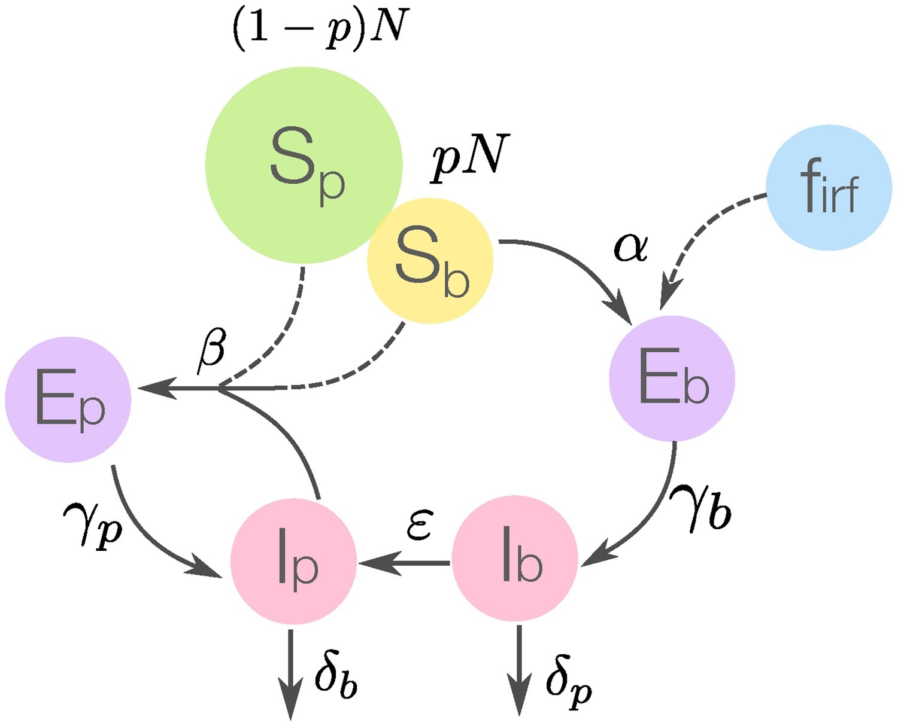

```{r setup, include=FALSE}
knitr::opts_chunk$set(echo = TRUE)
library(pander)
```


# Introductie
Als er gepraat wordt over de pest, wordt al snel gedacht aan de middeleeuwen. Toch is de pest in de huidige eeuw nog steeds een gevaar. Dit was te zien aan een uitbraak van de pest in Madagascar in 2017. Deze uitbraak heerste van augustus tot november\cite{Kinh18}. Tijdens deze uitbraak waren er 2417 gevallen van de pest, en 209 mensen kwamen om het leven door de pest. Het risico op nog een uitbraak bestaat nog altijd en omwille van betere preventie, is het belangrijk dat er gekeken wordt naar hoe de pest zich verspreidt en in welke vormen de ziekte voorkomt onder mensen. 

De pest wordt veroorzaakt door de bacterie *Yersinia pestis*, deze bacterie mag zich graag vestigen op kleine zoogdieren maar ook vlooien\cite{WHO}. Deze bacterie komt in mensen terecht door een bijt van een geinfecteerde vlooi, onbeschermd contact met geinfecteerd materiaal, of het inademen van kleine deeltjes die afkomstig zijn van een patient met longpest. 

De World Health Organisation spreekt over 2 vormen van een pest infectie. De builenpest, deze infectie is de meest voorkomende infectie soort. *Y. pestis* komt binnen door een bijt van een vlooi en komt zo in het lymfen systeem terecht. Eenmaal in dit systeem veroorzaakt het ontstekingen in de lymfe knopen. De builenpest kan leiden tot de volgende vorm van de pest, longpest. De longpest is de meeste virulente vorm de pest, en incubatie kan al voorkomen binnen 24 uur.

Alhoewel de pest nog steeds een gevaar blijft in verschillende landen, is de behandeling ervan goed te doen met veel voorkomende soorten antibiotica. Deze behandling werkt alleen wanneer diagnose vroeg verkregen kan worden.

\newpage

#Doel

Het doel van dit onderzoek is om te kijken of de vindingen van het artikel\cite{Kinh18} gerepliceerd kunnen worden. De vindingen zullen wat zeggen over hoe de pest tijdens de uitbraak verspreidt, en de potentiele invloed van het weer op de verspreiding van
de pest. Het model wat hiervoor gebruikt wordt, wordt onder de loep genomen.

\newpage

## Theorie

Bij dit onderzoek wordt het "Plague transmission model (PTM)" gebruikt. Dit model maakt gebruik van het SEIR (Susceptible-Exposed-Infectious-Removed (Vatbaar-blootgesteld-besmettelijk-hersteld)) model. Er wordt voor de S, E en I verandering per variant van de pest, longpest (p (pneumonic)) of builenpest (b (bubonic)), een differentiaal vergelijking opgesteld. Daarnaast wordt de verandering van hoeveel besmette vlooien (firf) in acht genomen en berekend door $firf = A+Bsin(2\pi/12t)+C*cos(2\pi/12t)$ gebasseerd op de temperatuur op madagascar. En het effect dat mensen hebben op het bestrijden van de pest op verschillende plaatsen (fitv), berekend door $fitv,h,f = 1-1/[1+0+exp(\tau h,f-t)]$

### Het model

Hieronder is een schematische weergave van het model gegeven die de verhouding hiertussen laat zien.
```{r, echo=FALSE, out.width='95%', fig.cap="Flowchart van het PTM(Kinh, 2018). Hier geven stippellijnen de factoren aan waar maatregelen een effect op kunnen hebben."}

```

S is het aantal mensen dat risico loopt op het krijgen van de variant van de ziekte omdat ze in de buurt zijn geweest van mensen met de ziekte. E is het aantal mensen dat ook in contact is geweest met de ziektekiemen. I is het aantal mensen dat geïnfecteerd is door de ziektekiemen en hierdoor de ziekte ook aan anderen kan doorgeven.
De totale populatie grootte wordt in N uitgedrukt. Hiervan is Sb het deel van de populatie dat risico loopt om in contact te komen met de ratten vlooien met de builenpest variant. Dit wordt pN genoemd. Sp is het deel van de populatie dat risico loopt om in contact te komen met de ratten vlooien met de longpest variant. Dit wordt (1-p)N genoemd.

Daarnaast zijn er nog een aantal parameters die snelheden van overdracht van de ziektes weergeven. Alpha ($\alpha$) i de snelheid waarmee de ziekte van vlo op mens wordt overgebracht. Beta ($\beta$) is de snelheid waarmee de pest van mens op mens wordt overgebracht. Delta ($\delta$) is de snelheid waarmee het aantal besmettelijke mensen weer afneemt, doordat ze beter worden of sterven. Epsilon ($\epsilon$) is de snelheid waarmee de builenpest bij geinfecteerde mensen overgaat in de longpest variant van de ziekte. Gamma ($\gamma$) is de hoeveelheid blootgestelde mensen (E) aan de ziekte, die er ziek van worden, waardoor ze besmettelijk (I) worden. 

### De formules

Met behulp van deze parameters kunnen de volgende differentiaal vergelijkingen opgesteld worden:

$$\frac{dS_b}{dt} = -S_b \alpha f_{irf}f_{itv,f} - \beta S_b \frac{I_p}{N}f_{itv,h}$$

$$\frac{dS_p}{dt} = -\beta S_p \frac{I_p}{N}f_{itv,h}$$

$$\frac{dE_b}{dt} = S_b \alpha f_{irf}f_{itv,f} - \gamma_b E_b$$

$$\frac{dE_p}{dt} = \beta(S_b + S_p) \frac{I_p}{N}f_{itv,h} - \gamma_pE_p$$

$$\frac{dI_b}{dt}=\gamma_b E_b - \epsilon I_b - \delta_bI_b$$

$$\frac{dI_p}{dt}=\gamma_p E_p + \epsilon I_b - \delta_pI_p$$
Hiermee worden de veranderingen in de hoeveelheid van de populatie die vatbaar zijn voor de longpest (Sp), vatbaar voor de builenpest (Sb), blootgesteld aan de longpest (Ep), blootgesteld aan de builenpest (Eb), geïnfecteerd door de longpest (Ip) en geïnfecteerd door de builenpest (Ib) bepaald.


# Methode

## Het software model
Gebruikt in dit model is R (versie 4.0.4) en de DeSolve library(versie 1.28)\cite{Soertaert10}.

Voor de parameters die verantwoordelijk zijn voor de dichtheid van de geinfecteerde vlo en rat populatie (firf), de waarde waarin de inverventie maatregelen van vlo tot mens wordt uitgedrukt(fitv_f), en de waarde waarin de inverventie maatregelen van mens tot mens wordt uitgedrukt(fitv_h), zijn functies. Deze functies worden als parameters meegegeven en zien er als volgt uit.

```{r}
func_firf <- function(t){
  return(1.15 + 0.08 * sin(2*pi/12*t) + 0.1 * cos(2*pi/12*t))
}


func_fitv_h <- function(t){
  return(1-1/(1+0.11+exp(8.89-t)))
}

func_fitv_f <- function(t){
  return(1-1/(1+0.11+exp(17.93-t)))
}
```

Het volgende model wordt gebruikt:
```{r}
library(deSolve)

PTM <- function(t,state,parms){
with(as.list(c(state,parms)),{
  dSb <- -Sb*alpha*firf(t)*fitv_h(t)-beta*Sb*Ip/N*fitv_h(t)
  dSp <- -beta*Sp*Ip/N*fitv_h(t)
  dEb <- Sb*alpha*firf(t)*fitv_f(t) - gamma_b * Eb
  dEp <- beta*(Sb + Sp) * Ip / N *fitv_h(t) - gamma_p * Ep
  dIb <- gamma_b * Eb - epsilon * Ib - delta_b * Ib
  dIp <- gamma_p * Ep + epsilon * Ib - delta_p * Ip
return(list(c(dSb, dSp, dEb, dEp, dIb, dIp)))
}
)
  }

```


## Model configuratie

Omdat het doel het repliceren van het artikel\cite{Kinh18} is, is er voor gekozen om dezelfde parameters te gebruiken.
```{r}
data.parameters <- read.csv("parameters.csv", header = T)
pander(data.parameters)
```

Voor de initiele waardes is er vanuit gegaan dat maar een klein deel van de populatie vatbaar is voor de pest. Deze fractie mensen wordt aangegeven met de waarde p. Voor een populatie van N is de hoeveelheid vatbare mensen voor de builenpest $pN$. De hoeveelheid mensen die vatbaar zijn voor de longpest is $(1-p)N$.

```{r}
ini.waardes <- read.csv("ini_waardes.csv", header = T)
pander(ini.waardes)
```

Uiteindelijk komt het model met de volgende waardes uit. De state zijn de initiele waardes, en de parameters zijn nu ingevuld. Voor de tijd wordt er per dag gekeken. Er is voor 60 dagen gekozen omdat de uitbraak ongeveer 3 maanden duurde.

```{r}
time <- c(seq(0, 60, by =1))

state <- c(Sb = 2557, Sp = 25568338, Eb = 0, Ep = 0, Ib = 1, Ip = 1)

parameters <- c(gamma_b = 0.23, gamma_p = 0.29, epsilon = 0.03,
           alpha = 0.0019, beta = 2.23, N = 25570895, delta_p = 0.34, delta_b = 0.26,
           firf = func_firf, fitv_f = func_fitv_f, fitv_h = func_fitv_h)
```

Met data uit het artikel zal het model gevalideerd worden. Deze data komt uit het figuur gepubliceerd door de World Health Organisation\cite{WHO_report}. Dit is alleen de data van de geinfecteerde mensen, en in deze data wordt er onderscheidt gemaakt tussen de variant builenpest en longpest.

```{r}
plague_cases <- read.csv("plague_data.csv", header = T, sep = "\t")
```


\newpage


# Resultaten

## Valideren model

Hieronder is te zien hoe het model verloopt vergeleken met het verloop aan de hand van de verkregen data punten.

```{r, fig.cap="In dit figuur is te zien hoe het model verloopt (zwarte lijn) en hoe de uitbraak daadwerkelijk verliep (rode punten). Het model ziet eerst een stijging en vervolgens een wat steilere daling. De data punten maken een wat minder hoge piek vergeleken met het model, maar ook hier is eerst een langzame steiging te zien en vervolgens weer de daling."}
out_1 <- ode(parms = parameters, time = time, y = state, func = PTM)

plot(out_1[,c("Ib")], type = "l", ylim = c(0, 20), xlab = "Dagen van 22/09/2017",
     ylab = "Pest infecties", main = "Builenpest")

points(plague_cases$bubonic[53:118], pch = 20, col = "red")

legend("topright", legend=c("Model", "Data builenpest"),
       col=c("black", "red"), lty=c(1, NA), cex=0.8, pch = c(NA, 20))
```

In figuur 2 is te zien dat alhoewel het model in het begin en op het eind goed verloopt, de piek niet helemaal goed op de datapunten zit. Het model heeft duidelijk een hogere piek, terwijl de data punten wat lager zitten. De piek lijkt wel op het goede moment te zitten.


```{r, fig.cap="In het volgende figuur is het verloop van de longpest te zien aan de hand van het model (zwarte lijn) en de data (rode punten). Hier is een vrij steile stijging te zien in zowel het model als de data, gevolgt door een geleidelijke daling."}
plot(out_1[,c("Ip")], type = "l", ylim = c(0, 80), xlab = "Dagen van 22/09/2017", 
     ylab = "Pest infecties", main = "Longpest")
points(plague_cases$pneumonic[53:118], pch = 20, col = "red")

legend("topright", legend=c("Model", "Data longpest"),
       col=c("black", "red"), lty=c(1, NA), cex=0.8, pch = c(NA, 20))
```

### Simulaties van het model 

Deze simulatie laat zien wat er gebeurt als de interventie perfect is, maar de tijd waarmee de interventie het maximum effect heeft hetzelfde blijft.

```{r, fig.cap="In het figuur is het gevolg van een perfecte interventie te zien (zwarte lijn) vergeleken met de orginele response(rode lijn). Bij de perfecte interventie op de groep van de vatbare is er te zien dat het eerst geleidelijk loopt met de orginele lijn, tot rond dag 20 waar het recht trekt. Bij de blootgestelde groep en de groep van geinfecteerde is er te zien dat het ook geleidelijk loopt, alleen de perfecte interventie lijn ziet een minder langere periode van uitbraak."}
perfect_intervention <- ode(parms = parameters_perfect_intervention, 
                            time = time, y = state, func = PTM)

plot(perfect_intervention, out_1, type = "l", main = c("Vatbaar Builenpest", "Vatbaar Longpest", 
                                                       "Blootgesteld Builenpest", "Blootgesteld longpest",
                                                       "Geinfecteerden Builenpest", "Geinfecteerden Longpest"),
     xlab = "Tijd in dagen")
```

De perfecte interventie op de groep vatbaren is te verklaren met het feit dat mensen die ziek zijn, niet vatbaar zijn. Wanneer er bij interventie minder zieke zijn, betekent dit dat mensen vatbaar blijven.

# Discussie en Conclusie
## Discussie
Bij de simulatie 'perfecte interventie' werd er gekeken naar wat er zou gebeuren ales er een perfecte interventie was tegenover de inperfecte interventie die daadwerkelijk gebeurde. Zoals verwacht blijven meer mensen langer vatbaar omdat deze niet blootgesteld of geinfecteerd waren. Blootgesteld en geinfecteerden met de builenpest zag een minder snel effect van de interventie omdat er hier een nadruk ligt op het voorkomen dat vlooien bij mensen komen\cite{Carnell22}, deze soort interventie duurt langer totdat het effect heeft. Dit terwijl longpest, hoewel het sneller verspreid, ook makkelijker te beinvloeden is aan de hand van maatregelen. 

## Conclusie 


\begin{thebibliography}{9}

\bibitem{Soertaert10}
Soetaert, K., Petzoldt, T., and Woodrow Setzer, R.: \textit{Solving differential equations in R: package deSolve}, J. Stat. Softw., 33, 1-25, 2010.

\bibitem{Kinh18}
Kinh Nguyen, V., Parra-Rojas, C., Hernandez-Varga, E. A. (2018, June 2).:\textit {The 2017 plague outbreak in Madagascar: Data descriptions and epidemic modelling.} ScienceDirect. https://doi.org/10.1016/j.epidem.2018.05.001 

\bibitem{WHO}
World Health Organization.:\textit {Plague. World Health Organization.} https://shorturl.at/dvHNR

\bibitem{Pander}
Daróczi G, Tsegelskyi R (2022).: \textit {pander:  An R ’Pandoc’ Writer. R package version 0.6.5},https://CRAN.R-project.org/package=pander

\bibitem{WHO_report}
World Health Organization.: \textit {Plague Outbreak Situation Reports.}, https://apps.who.int/iris/bitstream/handle/10665/259482/Ex-PlagueMadagascar20112017.pdf

\bibitem{Carnell22}
Carnell, H. (2022).:{Historical and modern responses to plague epidemics.} Journal of Humanitarian Affairs, 4(2), 3–11. https://doi.org/10.7227/jha.085 

\end{thebibliography}
